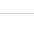
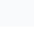

# Student Attendance Management System

A web-based Student Attendance Management System developed using **Java Spring Boot, MySQL, HTML, CSS, and JavaScript**.

## 📌 Project Description

The Student Attendance Management System helps manage student information and attendance records digitally.

The system allows users to:

* Register students
* View all registered students
* Update student information
* Delete student information
* Mark students as Present or Absent
* View attendance records
* Calculate attendance percentage
* Prevent duplicate attendance for the same student on the same date

## 🛠️ Technologies Used

* **Java**
* **Spring Boot**
* **Spring Data JPA**
* **REST API**
* **MySQL**
* **HTML**
* **CSS**
* **JavaScript**
* **Maven**
* **Git & GitHub**

## 🏗️ Project Architecture

```text
User
  ↓
HTML / CSS / JavaScript
  ↓
REST API
  ↓
Spring Boot Controller
  ↓
Service Layer
  ↓
Repository Layer
  ↓
MySQL Database
```

## 📂 Project Structure

```text
att/
│
├── pom.xml
├── README.md
│
├── screenshots/
│   ├── student-registration.jpg
│   ├── student-list.jpg
│   ├── mark-attendance.jpg
│   ├── attendance-records.jpg
│   └── attendance-percentage.jpg
│
└── src/
    └── main/
        ├── java/
        │   └── com/student/att/
        │       ├── AttApplication.java
        │       ├── controller/
        │       ├── model/
        │       ├── repository/
        │       └── service/
        │
        └── resources/
            ├── application.properties
            └── static/
                └── index.html
```

## ✨ Features

### 1. Student Registration

Users can register students with:

* Student name
* Roll number
* Branch
* Email

### 2. Student Management

The system provides:

* Create student
* View students
* Update student
* Delete student

### 3. Attendance Management

Attendance can be marked as:

* **Present**
* **Absent**

### 4. Attendance Records

The system displays attendance records with:

* Student name
* Roll number
* Attendance date
* Attendance status

### 5. Attendance Percentage

The system calculates:

```text
Attendance Percentage =
(Present Days / Total Attendance Records) × 100
```

### 6. Duplicate Prevention

The system prevents duplicate attendance for the same student on the same date.

## 🔗 REST APIs

### Student APIs

| Method | Endpoint         | Description       |
| ------ | ---------------- | ----------------- |
| POST   | `/students`      | Create a student  |
| GET    | `/students`      | Get all students  |
| GET    | `/students/{id}` | Get student by ID |
| PUT    | `/students/{id}` | Update student    |
| DELETE | `/students/{id}` | Delete student    |

### Attendance APIs

| Method | Endpoint      | Description                |
| ------ | ------------- | -------------------------- |
| POST   | `/attendance` | Mark attendance            |
| GET    | `/attendance` | Get all attendance records |

## 🗄️ Database

Database:

```text
student_attendance
```

Main tables:

```text
student
attendance
```

The attendance table uses a unique combination of:

```text
student_id + attendance_date
```

to prevent duplicate attendance records.

## 📸 Project Screenshots

### Student Registration


### Student List



### Mark Attendance


### Attendance Records


### Attendance Percentage



## ▶️ How to Run the Project

### 1. Clone the repository

```bash
git clone https://github.com/bollapellimahesh1-beep/student-attendance-management-system.git
```

### 2. Open the project

Open the project in **VS Code** or another Java IDE.

### 3. Create MySQL database

Open MySQL and run:

```sql
CREATE DATABASE student_attendance;
```

### 4. Configure database

Open:

```text
src/main/resources/application.properties
```

Configure your MySQL username and password.

### 5. Run the Spring Boot application

From the project folder:

```bash
mvn spring-boot:run
```

### 6. Open the application

Open your browser:

```text
http://localhost:8081/
```

## 🎓 Learning Outcomes

Through this project, I learned:

* Java programming
* Spring Boot
* REST API development
* Spring Data JPA
* MySQL database integration
* CRUD operations
* HTML, CSS and JavaScript
* Frontend-backend communication
* Git and GitHub

## 👨‍💻 Author

**Mahesh**

B.Tech – Electronics and Communication Engineering (ECE)

## 📌 Project Type

Academic / Learning Project

## ⭐ GitHub Repository

[Student Attendance Management System](https://github.com/bollapellimahesh1-beep/student-attendance-management-system)
# student-attendance-management-system